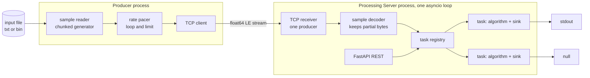

# Architecture

## Components



## Data flow

1. The Producer reads the file lazily in fixed size chunks and yields `float` samples (PRD-9).
2. The pacer groups samples into small batches and sends them on a deadline schedule, so the average rate equals `rate` samples per second without drift (PRD-5).
3. When the file ends, the reader reopens it; when `limit > 0` samples were sent, the Producer closes the socket (PRD-7, PRD-8).
4. The server receiver reads up to 64 KiB, the decoder prepends leftover bytes from the previous read, decodes all complete 8 byte samples and keeps the remainder (STR-1, STR-2). A non-finite decoded value is a protocol error and closes that Producer connection.
5. The registry passes the batch to every active task. Each task feeds samples to its algorithm one by one and writes every produced result to its sink.
6. Registry mutation and dispatch run on the same event loop and are serialized. A task becomes active when insertion completes, receives samples from later dispatches and never joins a dispatch already in progress. Removal takes effect before the next dispatch (SRV-7, SRV-8). STR-1 applies while the set of active tasks is unchanged.

## Module layout

```
pyproject.toml
src/
    common/
        protocol.py        wire format constant, struct format <d
    producer/
        __main__.py        CLI entry point, argument parsing
        readers.py         read_text_samples, read_binary_samples, registry by format
        streaming.py       repeat_samples, limit_samples, send_samples with pacing
    server/
        main.py            create_app, lifespan, run entry point
        settings.py        Settings (pydantic_settings)
        api/tasks.py       APIRouter /tasks
        api/stream.py      APIRouter /stream (connection status)
        schemas.py         Pydantic request and response models
        dependencies.py    Depends providers
        services/
            receiver.py    SampleReceiver: asyncio TCP server, one producer
            decoder.py     SampleDecoder: bytes to samples with remainder
            registry.py    TaskRegistry: create, find, list, remove, dispatch
            tasks.py       ProcessingTask
            algorithms.py  Algorithm protocol, Passthrough, Average, LinearRegression
            sinks.py       Sink protocol, NullSink, StdoutSink, convert_to_ascii
tests/
    unit/  integration/  system/
scripts/
    demo.py                starts server, creates tasks, runs producer
```

`services/` never imports FastAPI. The wire format constant (`struct` format `<d`) lives in one shared module `src/common/protocol.py` used by both applications.

## Interfaces

```python
class Algorithm(Protocol):
    """Turn a stream of samples into a stream of results."""

    def process_sample(self, sample: float) -> float | None:
        """Consume one sample and return a result when one is produced."""

    def read_statistics(self) -> dict[str, float | int | None]:
        """Return algorithm specific statistics."""


class Sink(Protocol):
    """Consume results produced by a task."""

    def write_results(self, results: list[float]) -> None:
        """Write a batch of results."""

    def close(self) -> None:
        """Release resources held by the sink."""
```

1. `WindowAlgorithm` is a small base class holding the current window (`list[float]` of at most `N` items) and `windows_processed`; `AverageAlgorithm` and `LinearRegressionAlgorithm` implement only `calculate_result(window) -> float` and their extra statistics.
2. `ProcessingTask` holds `task_id`, `config`, `algorithm`, `sink`, `samples_processed`, `created_at` and exposes `process_samples(samples: list[float]) -> None`.
3. Registries are plain dictionaries from name to factory: `ALGORITHM_FACTORIES: dict[str, Callable[[AlgorithmConfig], Algorithm]]`, `SINK_FACTORIES` likewise. Adding an algorithm means adding its implementation, configuration model and registry entry; existing algorithm classes remain unchanged.
4. `TaskRegistry.dispatch(samples)` iterates over a snapshot of active tasks.

## Concurrency model

1. One event loop runs both the HTTP server and the TCP receiver.
2. Processing is synchronous inside the receiver coroutine; it never awaits in the middle of a batch.
3. If processing is slower than input, the receiver reads less often, the TCP window fills and the Producer blocks on `sendall`. This is natural backpressure with bounded memory.
4. Dispatch catches exceptions per task. A failing task is marked `failed`, its sink is closed, and dispatch continues to the other tasks. Failed tasks remain queryable until deleted.
5. Stdout writes are assembled and flushed once per result batch. A slow or blocked stdout can still stall the event loop; this trade-off is accepted for the required demonstration sink.
